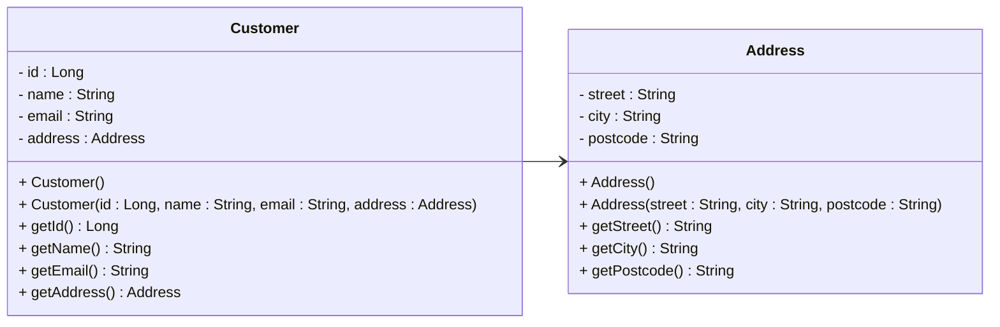

# Customer and Address — UML class diagram

A `Customer` has an `Address` (association, arrow pointing at `Address`).

```mermaid
classDiagram
    direction LR

    class Customer {
        - id : Long
        - name : String
        - email : String
        - address : Address
        + Customer()
        + Customer(id : Long, name : String, email : String, address : Address)
        + getId() Long
        + getName() String
        + getEmail() String
        + getAddress() Address
    }

    class Address {
        - street : String
        - city : String
        - postcode : String
        + Address()
        + Address(street : String, city : String, postcode : String)
        + getStreet() String
        + getCity() String
        + getPostcode() String
    }

    Customer --> Address
```
